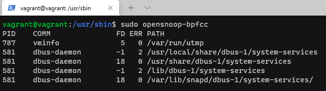

### Вопрос 1

chdir("/tmp")

### Вопрос 2

/usr/share/misc/magic.mgc

### Вопрос 3

1. Найти PID процесса
2. Проверить дескрипторы файлов, которые он открыл
3. Данный дескриптор (который пишет в файл) перенаправить в другой файл.

### Вопрос 4

Зомби-процессы не занимают ресурсы в ОС (CPU, RAM, IO), так как они уже выполнены и просто ждут завершения от родительского процесса.
Фактически это просто записи в таблице процессов ядра.

### Вопрос 5

### Вопрос 6
 uname({sysname="Linux", nodename="vvv-pc", ...})

 /proc/sys/kernel/{ostype, hostname, osrelease, version, domainname}

### Вопрос 7
Первый вариант (через ;) это просто последовательность команд.
Второй вариант: команда-1 && команда-2, команда-2 будет запущена, только если команда-1 завершается с успешным кодом возврата. Что не происходит в нашем случае.

Смысла использовать set -e нет. 
Если интерпретатор shell неинтерактивный, то осуществляется немедленный выход, в случае если команда завершилась с ненулевым кодом завершения работы.

### Вопрос 8

bash set -euxo pipefail 

    -е - указывает bash немедленно завершить работу, если какая-либо команда [1] имеет ненулевой статус выхода. 
    -u - влияет на переменные. Если установлено, ссылка на любую переменную, которую вы ранее не определили, за исключением $ * и $ @, является ошибкой и вызывает немедленный выход из программы.
    -x - включает режим оболочки, в котором все выполненные команды выводятся на терминал.
    -о pipefail - этот параметр предотвращает маскировку ошибок в конвейере. Если какая-либо команда в конвейере терпит неудачу, этот код возврата будет использоваться как код возврата всего конвейера. По умолчанию код возврата конвейера - это код последней команды, даже если она выполнена успешно.

Исключение скрытых ошибок.

### Вопрос 9

Самый частый Ss+ - процесс в состоянии ожидания

    s - лидер сессии
    + - находится в группе процессов переднего плана
