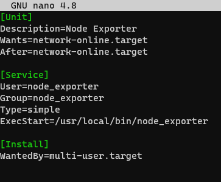
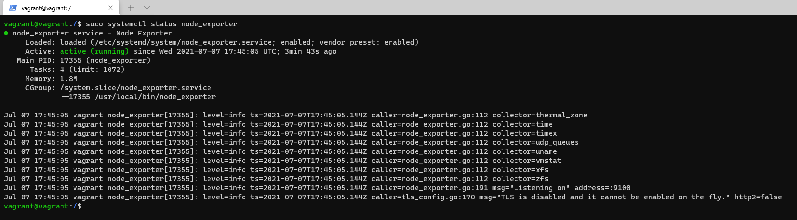
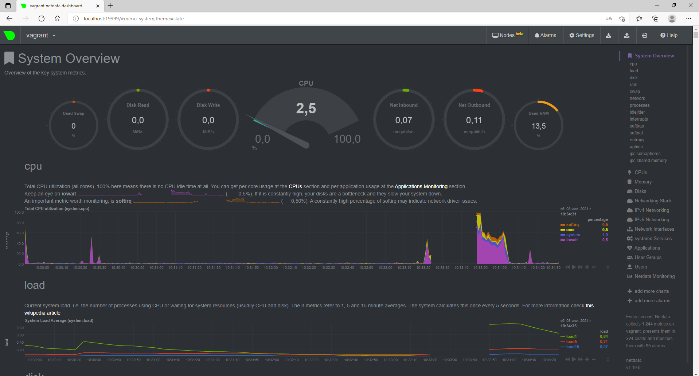
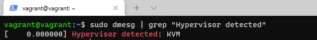
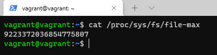
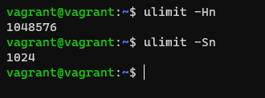
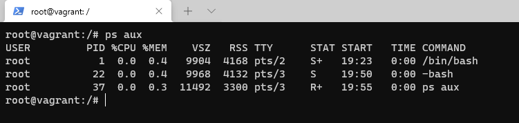
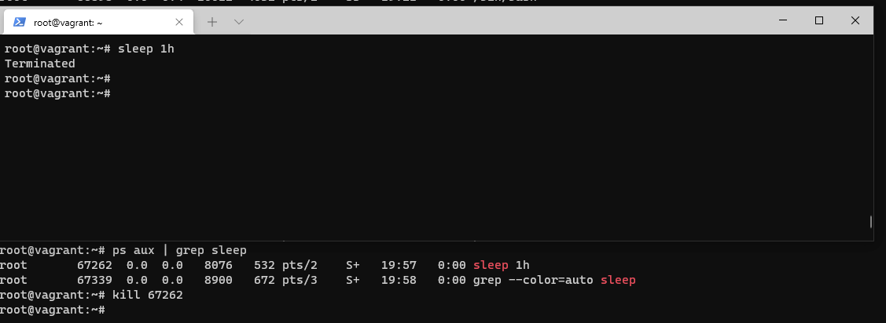

### Вопрос 1

sudo nano /etc/systemd/system/node_exporter.service

Добавляем сервис в автозагрузку, запускаем его, проверяем статус
$ sudo systemctl daemon-reload 
$ sudo systemctl enable --now node_exporter 
$ sudo systemctl status node_exporter

### Вопрос 2

    --collector.cpu 
    --collector.diskstats 
    --collector.filesystem 
    --collector.loadavg 
    --collector.meminfo 
    --collector.netstat 
    --collector.tcpstat 

### Вопрос 3

### Вопрос 4

Если система была бы физическая, то мы не увидели бы никаких выходных данных.

### Вопрос 5

fs.nr_open = 1048576 (Лимит на количество открытых дескрипторов) 

- максимальное количество файловых дескрипторов

-Hn — жесткий лимит максимального кол-ва открытых файловых дискрипторов

-Sn — мягкий лимит максимального кол-ва открытых файловых дискрипторов

### Вопрос 6

### Вопрос 7

:(){ :|:& };: - Это краш-тест. Вилочная бомба. 

Необходимо ограничить максимальное количество процессов, которыми может владеть один пользователь

    - ulimit -S -u количество 
    - Предел может быть также установлен в /etc/security/limits.conf

cgroup: fork rejected by pids controller – kernel причина остановки из-за максимального числа активных PID или потоков.

