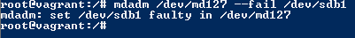

### Вопрос 1

Done

### Вопрос 2

НЕТ.

Жесткая ссылка и файл, для которой она создавалась имеют одинаковые inode. Поэтому жесткая ссылка имеет те же права доступа, владельца и время последней модификации, что и целевой файл. Различаются только имена файлов. Фактически жесткая ссылка это еще одно имя для файла.

### Вопрос 3

### Вопрос 4

### Вопрос 5

sfdisk -d /dev/sdb | sudo sfdisk /dev/sdc –force

### Вопрос 6

mdadm --create --verbose /dev/md0 -l 1 -n 2 /dev/sd{b1,c1}

### Вопрос 7

mdadm --create --verbose /dev/md1 -l 0 -n 2 /dev/sd{b2,c2}

### Вопрос 8

pvcreate /dev/md126 /dev/md127

### Вопрос 9

vgcreate vg01 /dev/md126 /dev/md127

### Вопрос 10

lvcreate -L 100 -ntestlv vg01 /dev/md126

### Вопрос 11

mkfs.ext4 /dev/vg01/testlv

### Вопрос 12

mount /dev/vg01/testlv /tmp/new

### Вопрос 13

wget https://mirror.yandex.ru/ubuntu/ls-lR.gz -O /tmp/new/test.gz

### Вопрос 14

### Вопрос 15

### Вопрос 16

### Вопрос 17

### Вопрос 18

### Вопрос 19

### Вопрос 20

