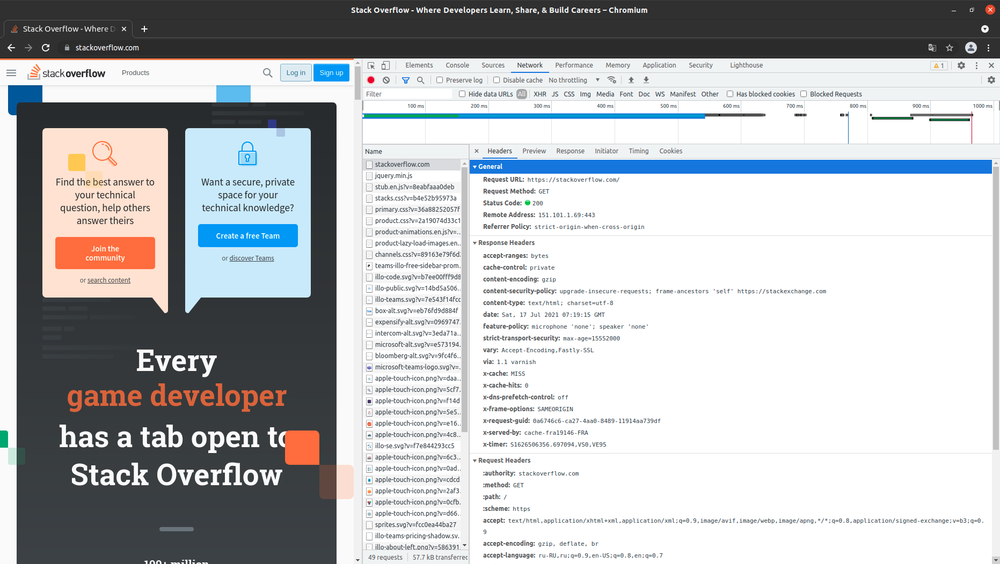
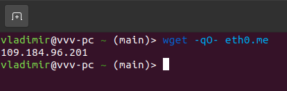
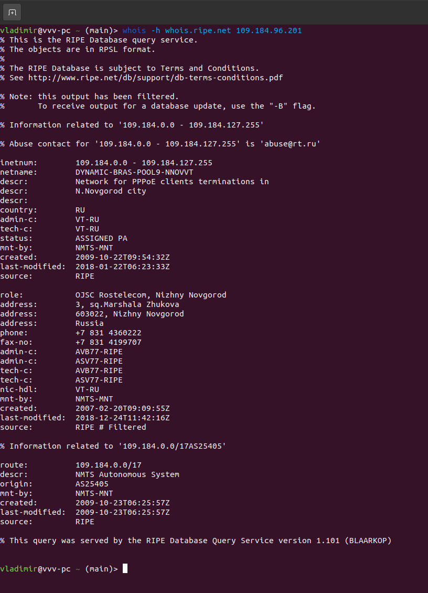
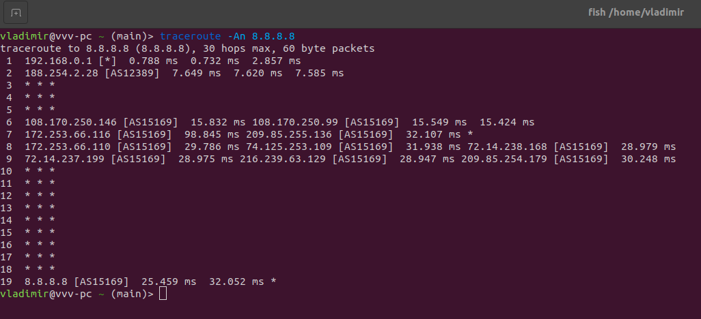
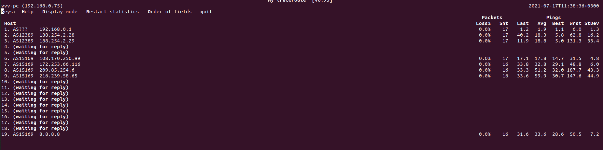
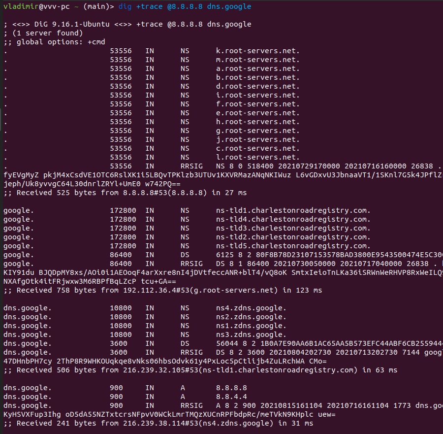
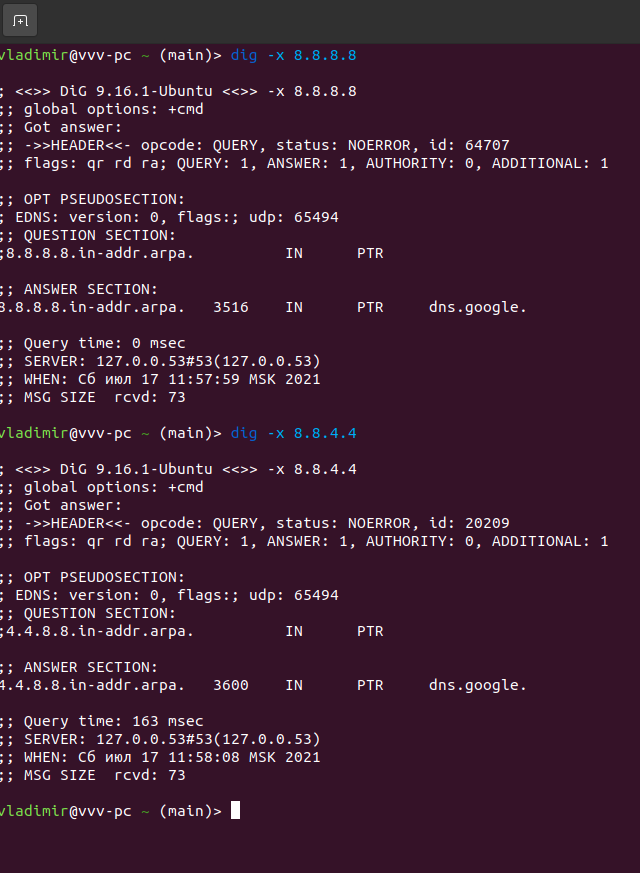

### Вопрос 1

    HTTP/1.1 301 Moved Permanently («Перемещено навсегда». ресурс был на постоянной основе перемещён в новое месторасположение)
    cache-control: no-cache, no-store, must-revalidate
    location: https://stackoverflow.com/questions  (Адрес нового месторасположения ресурса )
    x-request-guid: 7002d232-0cb5-487f-bea5-9e8bf9fb2bc9
    feature-policy: microphone 'none'; speaker 'none'
    content-security-policy: upgrade-insecure-requests; frame-ancestors 'self' https://stackexchange.com
    Accept-Ranges: bytes
    Date: Sat, 17 Jul 2021 07:06:01 GMT
    Via: 1.1 varnish
    Connection: close
    X-Served-By: cache-fra19155-FRA
    X-Cache: MISS
    X-Cache-Hits: 0
    X-Timer: S1626505562.537435,VS0,VE92
    Vary: Fastly-SSL
    X-DNS-Prefetch-Control: off
    Set-Cookie: prov=80a2a68e-b7f3-72c7-daba-3b7d89c6af23; domain=.stackoverflow.com; expires=Fri, 01-Jan-2055 00:00:00 GMT; path=/; HttpOnly

### Вопрос 2

укажите в ответе полученный HTTP код.
        
        Status Code: 200 
        Remote Address: 151.101.1.69:443
        Referrer Policy: strict-origin-when-cross-origin

        accept-ranges: bytes
        cache-control: private
        content-encoding: gzip
        content-security-policy: upgrade-insecure-requests; frame-ancestors 'self' https://stackexchange.com
        content-type: text/html; charset=utf-8
        date: Sat, 17 Jul 2021 07:19:15 GMT
        feature-policy: microphone 'none'; speaker 'none'
        strict-transport-security: max-age=15552000
        vary: Accept-Encoding,Fastly-SSL
        via: 1.1 varnish
        x-cache: MISS
        x-cache-hits: 0
        x-dns-prefetch-control: off
        x-frame-options: SAMEORIGIN
        x-request-guid: 0a6746c6-ca27-4aa0-8489-11914aa739df
        x-served-by: cache-fra19146-FRA
        x-timer: S1626506356.697094,VS0,VE95
        
проверьте время загрузки страницы, какой запрос обрабатывался дольше всего?

        Request URL: https://stackoverflow.com/
        Request Method: GET

        :authority: stackoverflow.com
        :method: GET
        :path: /
        :scheme: https
        accept: text/html,application/xhtml+xml,application/xml;q=0.9,image/avif,image/webp,image/apng,*/*;q=0.8,application/signed-exchange;v=b3;q=0.9
        accept-encoding: gzip, deflate, br
        accept-language: ru-RU,ru;q=0.9,en-US;q=0.8,en;q=0.7
        cookie: prov=b8b69b15-f3d0-40d2-435b-631adddc981b; _ym_uid=1613208159769174420; _ym_d=1613208159; _ga=GA1.2.442579563.1613208159; __gads=ID=53d724f5c6108298:T=1613208159:S=ALNI_MZbuV2Uf6c-i4scE_3eHgJ7lHti8Q; __qca=P0-1826933907-1613208159076; OptanonAlertBoxClosed=2021-05-26T19:33:09.132Z; OptanonConsent=isIABGlobal=false&datestamp=Wed+May+26+2021+22%3A33%3A09+GMT%2B0300+(%D0%9C%D0%BE%D1%81%D0%BA%D0%B2%D0%B0%2C+%D1%81%D1%82%D0%B0%D0%BD%D0%B4%D0%B0%D1%80%D1%82%D0%BD%D0%BE%D0%B5+%D0%B2%D1%80%D0%B5%D0%BC%D1%8F)&version=6.10.0&hosts=&landingPath=NotLandingPage&groups=C0003%3A1%2CC0004%3A1%2CC0002%3A1%2CC0001%3A1; mfnes=5cf1CBcQAxoLCJaf4fv5md45EAUgCigBMgg4NWYzMWU4Zg==; _gid=GA1.2.1081439906.1626506101
        sec-ch-ua: "Chromium";v="91", " Not;A Brand";v="99"
        sec-ch-ua-mobile: ?0
        sec-fetch-dest: document
        sec-fetch-mode: navigate
        sec-fetch-site: none
        sec-fetch-user: ?1
        upgrade-insecure-requests: 1
        user-agent: Mozilla/5.0 (X11; Linux x86_64) AppleWebKit/537.36 (KHTML, like Gecko) Chrome/91.0.4472.114 Safari/537.36

### Вопрос 3

### Вопрос 4

OJSC Rostelecom, Nizhny Novgorod

AS = AS25405

### Вопрос 5

Через какие сети проходит пакет, отправленный с вашего компьютера на адрес 8.8.8.8? 

Через какие AS? 

    AS12389 (ROSTELECOM NETS)
    AS15169 (Google LLC (GOGL))

### Вопрос 6

Повторите задание 5 в утилите mtr. 

    AS12389 (ROSTELECOM NETS)
    AS15169 (Google LLC (GOGL))

На каком участке наибольшая задержка - delay?

    На 9м шаге самая большая средняя задержка.

### Вопрос 7

Какие DNS сервера отвечают за доменное имя dns.google? 

    много серверов. скрин ниже

Какие A записи? 

    dns.google.		74	IN	A	8.8.4.4
    dns.google.		74	IN	A	8.8.8.8

### Вопрос 8

    8.8.8.8.in-addr.arpa.	3516	IN	PTR	dns.google.
    4.4.8.8.in-addr.arpa.	3600	IN	PTR	dns.google.
