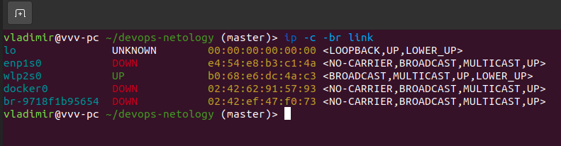
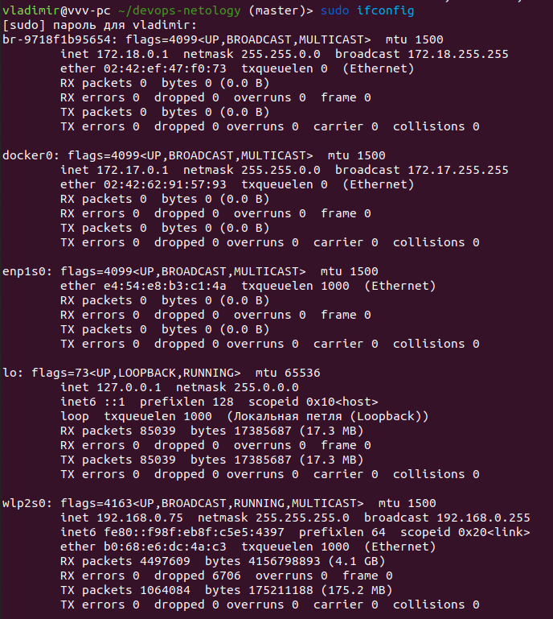
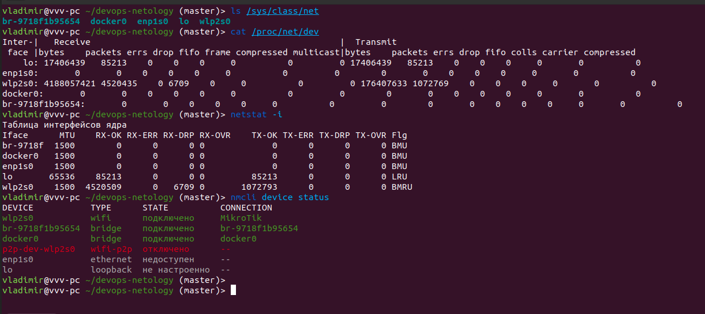
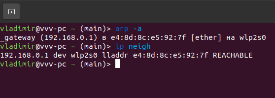
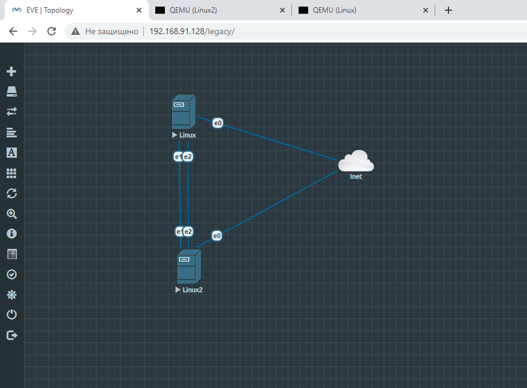
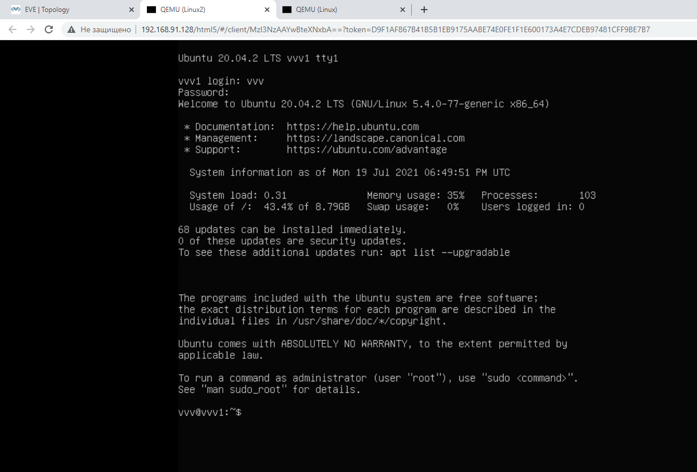
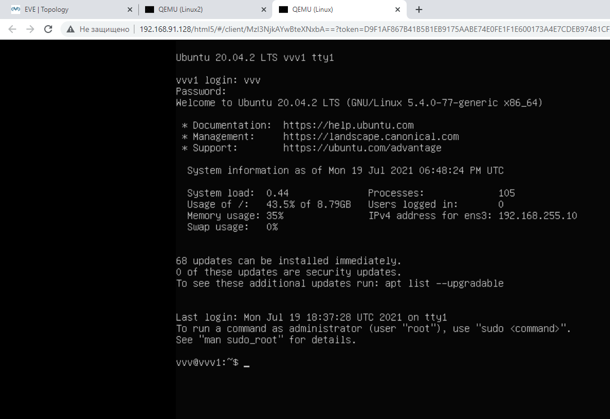

### Вопрос 1
Linux

Windows 

    ipconfig /all

### Вопрос 2

LLDP протокол. Использует канальный уровень (L2).

Команда lldpctl

### Вопрос 3

VLAN - Virtual Local Area Network

Можно настроить через ifconfig и ip. Также через конфигурационный файл /etc/network/interfaces

Настройка на моем wifi VLAN

    ip link add link wlp2s0 name wlp2s0.100 type vlan id 100
    ip addr add 192.168.0.2/24 brd 192.168.0.1 dev wlp2s0.100
    ip link set dev wlp2s0.100 up

### Вопрос 4

Тип LAG:

    1. статический
    2. динамически - LACP (Link Aggregation Control Protocol) 
    3. проприетарный - PAgP (Port Aggregation Protocol) 

В зависимости от модели коммутатора, могут поддерживаться такие методы балансировки:

    1. по MAC-адресу отправителя или MAC-адресу получателя или учитывая оба адреса
    2. по IP-адресу отправителя или IP-адресу получателя или учитывая оба адреса
    3. по номеру порта отправителя или номеру порта получателя или учитывая оба порта

Пример. Балансировка нагрузки по MAC-адресам или IP-адресам

    sw(config)# trunk-load-balance L3-based

### Вопрос 5
    8 IP адресов
    256/8 = 32 подсети

Приведите несколько примеров /29 подсетей внутри сети 10.10.10.0/24.

    10.10.10.0/29 
    10.10.10.8/29
    10.10.10.16/29
    ...
    10.10.10.248/29

### Вопрос 6
Взять из сети 100.64.0.0/10. Установить маску /27

### Вопрос 7

(в Windows работает arp -a)

ip neigh flush all

arp -d [IP_adress]

### Вопрос 8*

