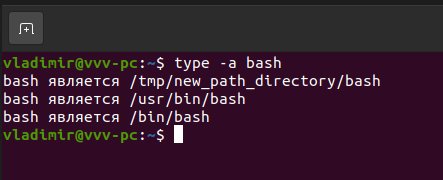

### Задание №8
a) History-size - line 1817

b)  1. строки, начинающиеся с символа пробела, не считаются
2. строки, соответствующие предыдущей записи в истории, не сохраняются. 

### Задание №9

Составные команды — line 199 (а точнее 206)

### Задание №10

1. touch {0..100000}
2. Получилось, только после увеличения размера  stack size (с помощью 
	команды ulimit -s размер в kbytes)
   

### Задание №11

Возвращает статус 0 или 1 в зависимости от оценки условного выражения выражения (существует ли директория /tmp)

### Задание №12

- mkdir /tmp/new_path_directory
- cp /bin/bash /tmp/new_path_directory/

- Внес изменения в файл /etc/environment
PATH="/tmp/new_path_directory/:/usr/local/sbin:/usr/local/bin:/usr/sbin:/usr/bin:/sbin:/bin:/usr/games:/usr/local/games:/snap/bin"
 
Результат вывода команды: type -a bash

### Задание №13

batch, планирует задания и выполняет их в очереди пакетов, когда позволяет уровень загрузки системы. Если средняя загрузка системы выше указанной, задания будут ждать в очереди. А команда at выполняет задание в заданное время, не смотря не на что.
